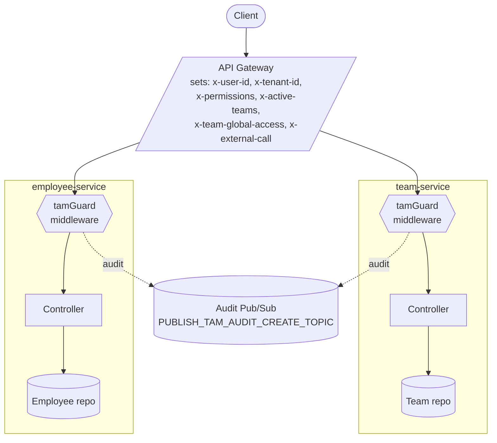
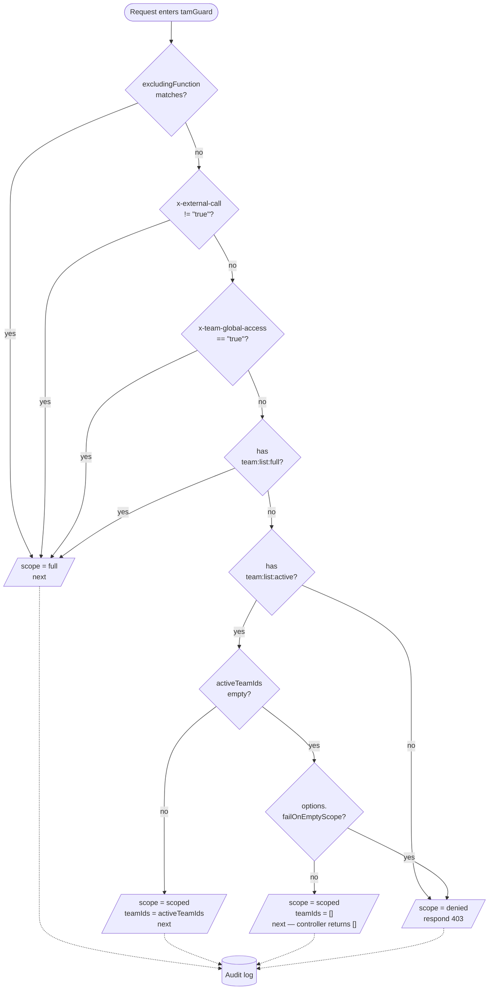
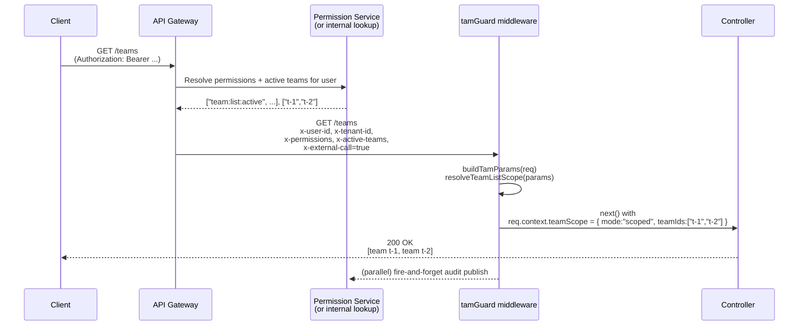
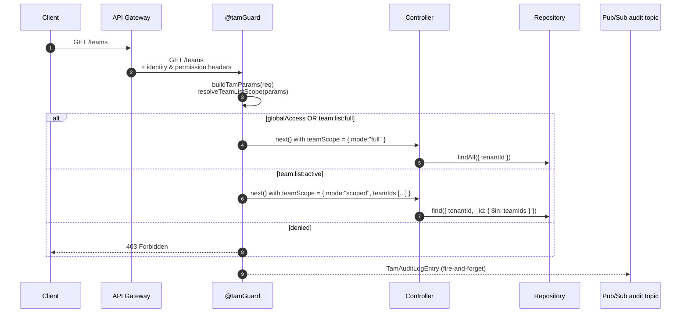
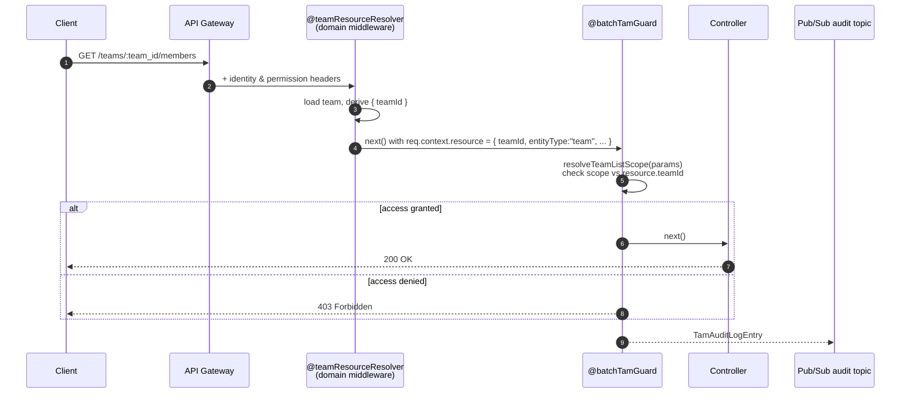
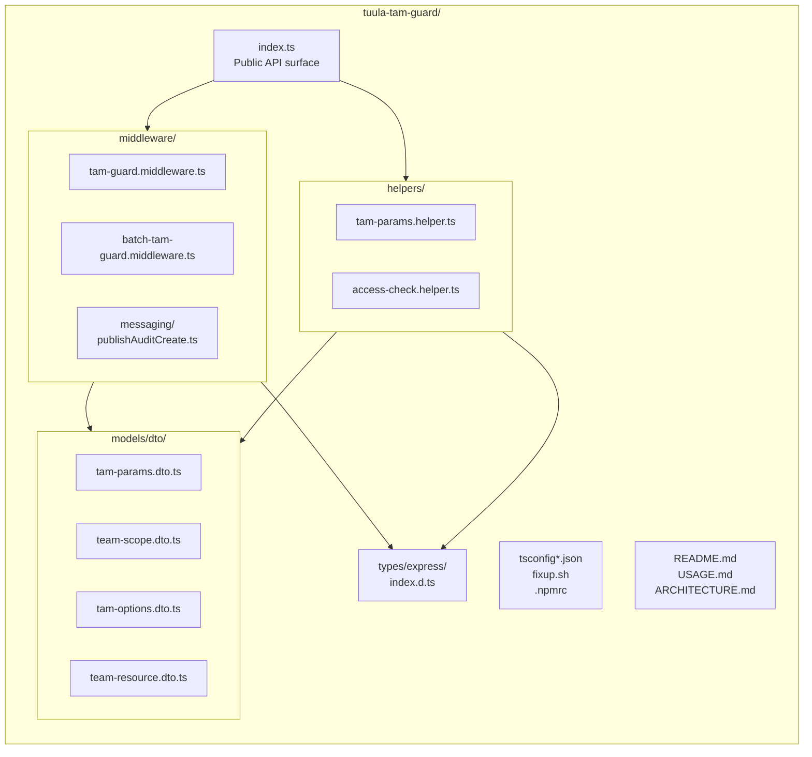
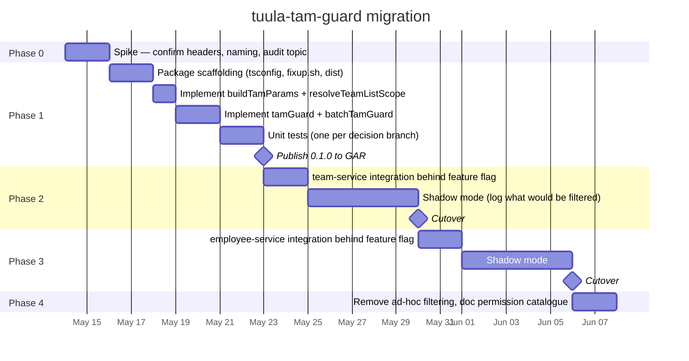

# tuula-tam-guard — Design Proposal

**Status:** Proposal, not yet implemented
**Owner:** _to be assigned_
**Related ticket:** Split authorization for `team:list` into team-based and full access
**Last updated:** 2026-05-13
**Sibling package:** `@tuula/tuula-cfam-guard` — this proposal deliberately mirrors its conventions so dependent services have one mental model for "guard middleware in front of a service".

---

## 1. Problem statement (from the ticket)

> As an organization, we want to split the authorization for `team:list` into two separate permission levels, so that users only see the teams (and employees in them) relevant to their role and team.
>
> - **`team:list:full`** — keeps the current behavior. Users see all teams.
> - **`team:list:active`** — users only see the team(s) they are **actively** part of.
>     - User active in *Test team* → sees only *Test team*.
>     - User active in *Test team* + *Jeugd Midden* → sees those two teams.

This affects two services:

- **`team-service`** — `GET /teams`, `GET /teams/:id`, `GET /teams/:id/members`, …
- **`employee-service`** — endpoints that filter by team, return team rosters, or expose employees inside a team.

The unit of authorization is **the team a user is a member of**, not the carefile. The existing `tuula-cfam-guard` is carefile-scoped and has no concept of team rosters, so a sibling package is the right answer: **`@tuula/tuula-tam-guard`** (Team Access Management).

> **Naming note.** The ticket uses `team:list:team`. We are proposing `team:list:active` instead — it lines up with the ticket's own wording ("actively are part of"), stays in conventional lowercase colon-separated permission strings, and avoids the awkward `team:list:team` repetition. Final naming is one of the open questions in §9.

---

## 2. Goals & non-goals

### Goals

1. Centralize team-scope authorization in one library used by both `team-service` and `employee-service` (and any future consumer that returns team-shaped data).
2. Make `team:list:active` vs `team:list:full` an enforced **scoping decision**, not per-endpoint copy-paste filter code.
3. Match the existing `tuula-cfam-guard` shape so dependent services have one mental model.
4. Audit every team-access decision the same way `batchCfamGuard` does today.

### Non-goals

1. Replacing the API gateway's permission lookup. This package **consumes** permissions; it does not own them.
2. Owning team membership data. Membership comes from `team-service`.
3. Modeling permissions other than `team:list:*`. The package is designed to be extensible (`team:read:*`, `employee:list:*`) but the first cut ships only the `team:list:*` split.

---

## 3. High-level architecture



The middleware does **not** query a database. It reads permissions + active-team list off the request (already populated by the gateway), produces a typed `TeamScope`, attaches it to `req.context.teamScope`, and lets the controller / repository apply the filter.

---

## 4. The `TeamScope` decision

Inside `tamGuard`, the resolution of headers → `TeamScope` is the entire heart of the package:



**Precedence order** (top to bottom): explicit exclusion → internal call → global access bypass → `team:list:full` → `team:list:active`. `full` always wins over `active` if a user holds both.

---

## 5. Public API (proposed)

The shape mirrors `tuula-cfam-guard` one-to-one. If you know cfam-guard, you know this.

```ts
// index.ts

import type {} from "./types/express";

export { tamGuard, batchTamGuard, logTeamAccessAudit } from "./middleware";
export {
    buildTamParams,
    TamValidationError,
    hasAccessToTeam,
    hasAccessToTeams,
    getAllowedTeamIds,
    resolveTeamListScope,
    buildHeaders,
} from "./helpers";
export type { TamAuditLogEntry, TeamResourceScope, TamOptions } from "./models";
export { TamParams, TeamScope } from "./models";
```

### 5.1 Core types

```ts
// models/dto/tam-params.dto.ts
export interface TamParams {
    userId: string;
    tenantId: string;
    role?: string;
    userType?: string;
    isExternalCall?: boolean;
    /**
     * Request-time bypass flag. Parallels x-carefile-global-access.
     * When true, scope is always { mode: "full" } and no permission check is run.
     * Use for break-glass / system / internal accounts that are not in the
     * permission catalogue.
     */
    globalAccess?: boolean;
    /**
     * Permission strings the user holds in this tenant, normalized.
     * e.g. {"team:list:full", "carefile:view", ...}
     * Source: x-permissions header (CSV) — see §6.2.
     */
    permissions: Set<string>;
    /**
     * Active team memberships for this user in this tenant.
     * Source: x-active-teams header (CSV of team IDs).
     */
    activeTeamIds: string[];
}

// models/dto/team-scope.dto.ts
export type TeamScope =
    | { mode: "full" }                              // see all teams
    | { mode: "scoped"; teamIds: string[] }         // see only these teams
    | { mode: "denied"; reason: string };           // see nothing — respond 403

// models/dto/tam-options.dto.ts
export type TamOptions = {
    /**
     * The action being authorized. First release supports "team:list".
     * Future: "team:read", "employee:list", ...
     */
    action: "team:list";
    /**
     * If true, a user with team:list:active but zero active memberships
     * receives 403 instead of an empty list. Default: false.
     */
    failOnEmptyScope?: boolean;
    excludingFunction?: (req: Request) => boolean;
};
```

### 5.2 Why a discriminated union for `TeamScope`?

Because team authorization is fundamentally a **filter**, not a yes/no grant. A controller has to know:

- Should I run an unfiltered query? (`full`)
- Should I run a filtered query? (`scoped`, with the IDs)
- Should I refuse outright? (`denied`)

Encoding this as three modes forces controllers to handle every case explicitly. Type-narrowing in the controller is then mechanical:

```ts
const { teamScope } = req.context;
if (teamScope.mode === "denied") return res.forbidden({ message: teamScope.reason });
if (teamScope.mode === "full")   return res.ok(await this.repo.findAll(tenantId));
return res.ok(await this.repo.findByIds(tenantId, teamScope.teamIds));
```

---

## 6. Header contract



### 6.1 Header table

| Header                  | Required        | Type    | Purpose                                                                       |
|-------------------------|-----------------|---------|-------------------------------------------------------------------------------|
| `x-user-id`             | Yes             | string  | Authenticated user                                                            |
| `x-tenant-id`           | Yes             | string  | Tenant                                                                        |
| `x-external-call`       | No              | boolean | Same semantics as cfam-guard — guard is enforced only on external calls       |
| `x-current-role`        | No              | string  | Forwarded for audit                                                           |
| `x-user-type`           | No              | string  | employee / client / client_network                                            |
| `x-permissions`         | Yes (external)  | CSV     | Permission strings, e.g. `team:list:full,carefile:view,…`                     |
| `x-active-teams`        | Yes (when only `team:list:active`) | CSV | Team IDs the user is currently a member of in this tenant   |
| `x-team-global-access`  | No              | boolean | Request-time bypass flag — parallel to `x-carefile-global-access`             |
| `x-correlation-id`      | No              | string  | Threaded into audit entries                                                   |

### 6.2 Why header-sourced permissions

Two reasons.

1. **Convention.** The API gateway already populates `x-current-role` and `x-carefile-global-access`. The gateway is already the trusted source of identity context.
2. **Latency.** No HTTP call from inside the middleware — this is the main reason this guard is cheaper than `cfam-guard`. The `MIGRATION_PLAN_OPENFGA.md` performance budget (p95 < 50ms) is easier to hit when there is no out-of-process check on the hot path.

If the gateway cannot populate `x-permissions` + `x-active-teams` in phase 1, `buildTamParams` can fall back to a single permission-service HTTP call, cached per request. Design `buildTamParams` so the source is swappable without changing the public API — this is also what allows a future OpenFGA bridge (§10).

### 6.3 Why keep `x-team-global-access` even though `team:list:full` exists

They serve different purposes:

| Mechanism                  | Use case                                                   |
|----------------------------|------------------------------------------------------------|
| `team:list:full` permission | Normal authorization. Held by users with that role in the permission catalogue. |
| `x-team-global-access` header | Break-glass / system / internal accounts not in the catalogue. Ops can flip a flag in the gateway without touching the catalogue. |

If you only ship `team:list:full`, every internal/system account needs an entry in the permission catalogue. The bypass header is the escape hatch for "I need to debug production right now" and for service accounts. Matches the `x-carefile-global-access` pattern in cfam-guard for exactly this reason.

---

## 7. Request lifecycle

### 7.1 List endpoint flow



### 7.2 Resource (batch) endpoint flow

For endpoints that operate on a **specific team or employee inside a team** (`GET /teams/:id`, `GET /teams/:id/members`, `GET /employees/:id`). Mirrors `batchCfamGuard`: a domain-owned resolver populates `req.context.resource = { teamId, ... }`, then `batchTamGuard` checks `scope` against `resource.teamId`.



### 7.3 Decorator order (same as cfam-guard)

In `inversify-express-utils`, the decorator closest to the method runs first. So:

```ts
@httpGet("/:team_id")
@batchTamGuard({ action: "team:list" })     // runs second
@teamResourceResolver({ ... })              // runs first
```

The resolver runs first because `batchTamGuard` needs `req.context.resource.teamId` to be populated before it can decide. This matches the cfam-guard rule exactly.

---

## 8. Package layout

Mirrors cfam-guard one-to-one:



### 8.1 Express augmentation — shared `req.context` shape

Both `tuula-cfam-guard` and `tuula-tam-guard` extend `req.context`. TypeScript declaration merging handles the union, so dependent services can include both packages without type conflicts.

```ts
// types/express/index.d.ts
declare global {
    namespace Express {
        interface Request {
            context: {
                teamScope?: TeamScope;
                resource?: TeamResourceScope | unknown;
                // other guards may add their own keys
            };
        }
    }
}
```

---

## 9. Helpers (pure, service-layer use)

Unlike the cfam-guard helpers, **the tam-guard helpers do not perform HTTP calls** — the permission + active-team data is already on the request via headers. They are pure functions, safe to call repeatedly from a repository filter without latency penalty.

```ts
// helpers/tam-params.helper.ts
buildTamParams(req: Request): TamParams
parseBooleanHeader(value): boolean | undefined
parseCsvHeader(value): string[]

// helpers/access-check.helper.ts
resolveTeamListScope(params: TamParams, opts?: TamOptions): TeamScope
hasAccessToTeam(params: TamParams, teamId: string): boolean
hasAccessToTeams(params: TamParams, teamIds: string[], mode?: "all" | "some"): boolean
getAllowedTeamIds(params: TamParams, teamIds: string[]): string[]
```

`resolveTeamListScope` is the entry point. The other helpers are wrappers around it for ergonomic service-layer use.

---

## 10. Audit logging

Same shape as `CfamAuditLogEntry`, renamed with team-specific fields.

```ts
export type TamAuditLogEntry = {
    userId: string;
    fullName?: string;
    role?: string;
    tenantId: string;
    endpoint?: string;
    method?: string;
    action?: string;            // "team:list"
    paramMap?: Record<string, string>;
    entityType?: string;        // "team" | "employee"
    entityId?: string;
    teamId?: string;
    teamIds?: string[];         // when scoping is applied
    scopeMode: "full" | "scoped" | "denied";
    allowed: boolean;
    status?: string;
    message?: { language?: string; text: string };
    auditDateTime: string;
    correlationId?: string;
};
```

```mermaid
flowchart LR
    Decision[Guard decision]
    Console[(stdout<br/>[TAM_ACCESS_AUDIT])]
    Publisher[publishAuditCreate]
    Topic[(Pub/Sub topic<br/>PUBLISH_TAM_AUDIT_CREATE_TOPIC)]
    Downstream[(Audit pipeline<br/>logbook + auditlog services)]

    Decision -->|sync| Console
    Decision -->|fire-and-forget| Publisher
    Publisher -->|may fail silently| Topic
    Topic --> Downstream
```

**Recommendation:** introduce `PUBLISH_TAM_AUDIT_CREATE_TOPIC` from day one rather than re-using `PUBLISH_GK_AUDIT_CREATE_TOPIC`. The cfam-guard `PH3_RELEASE_NOTES.md` already flags the existing name as too generic. One topic per guard package keeps fan-out independent and makes it possible to silence team-audit traffic without affecting carefile-audit.

---

## 11. Integration plan

### 11.1 `team-service`

| Endpoint                       | Action      | Guard                                                              |
|--------------------------------|-------------|--------------------------------------------------------------------|
| `GET /teams`                   | `team:list` | `@tamGuard({ action: "team:list" })`                               |
| `GET /teams/:team_id`          | `team:list` | `@teamResourceResolver` + `@batchTamGuard({ action: "team:list" })` |
| `GET /teams/:team_id/members`  | `team:list` | `@teamResourceResolver` + `@batchTamGuard(...)`                    |
| `POST /teams`                  | `team:create` | _not in scope yet_                                               |
| `PATCH /teams/:team_id`        | `team:update` | _not in scope yet_                                               |

Repository call becomes:

```ts
async listTeams(scope: TeamScope, tenantId: string) {
    if (scope.mode === "full")   return this.repo.find({ tenantId });
    if (scope.mode === "scoped") return this.repo.find({ tenantId, _id: { $in: scope.teamIds } });
    return [];
}
```

### 11.2 `employee-service`

| Endpoint                          | Action            | Guard                                                      |
|-----------------------------------|-------------------|------------------------------------------------------------|
| `GET /employees`                  | `team:list`*      | `@tamGuard({ action: "team:list" })`                       |
| `GET /employees?teamId=...`       | `team:list`       | `@tamGuard(...)` + service-layer `hasAccessToTeam` check   |
| `GET /teams/:team_id/employees`   | `team:list`       | `@teamResourceResolver` + `@batchTamGuard(...)`            |
| `GET /employees/:id`              | `team:list`*      | `@employeeResourceResolver` (computes employee's teamIds) + `@batchTamGuard(...)` |

*An employee is visible if at least one of their team memberships intersects `scope.teamIds`, or if `scope.mode === "full"`. Implementation lives in the employee-service repository, fed by `scope`.

---

## 12. Migration roadmap



### Phase rationale

- **Phase 0 — Spike** is non-negotiable: the package shape depends on whether the gateway can populate `x-permissions` + `x-active-teams`. Confirm before building.
- **Phase 1 — Scaffolding** is the right place to set the testing baseline the cfam-guard package never got (see `HANDOVER.md` §11.6).
- **Phase 2 / 3 — Shadow mode** is what gives confidence to flip the flag. In shadow mode the guard runs and **logs** what it would have filtered but does not change the response. Compare shadow logs against production responses for a week before cutover.
- **Phase 4 — Cleanup** removes the legacy ad-hoc filtering. Without this, the codebase has two ways to filter teams and someone will eventually pick the wrong one.

---

## 13. Edge cases & decisions to make before coding

1. **User has both `team:list:active` and `team:list:full`** — `full` wins (encoded in §4).
2. **User has `team:list:active` but no active teams** — default returns empty list. Opt-in `failOnEmptyScope: true` returns 403. Confirm with product which is expected.
3. **Internal service-to-service calls** — match cfam-guard: when `x-external-call !== "true"`, default to `{ mode: "full" }`. Preserves existing internal flows.
4. **OpenFGA forward-compat** — see `tuula-cfam-guard/MIGRATION_PLAN_OPENFGA.md`. Build `buildTamParams` so the header source is swappable for an OpenFGA `listObjects` call without changing the public API.
5. **Performance** — full-scope users have zero overhead; scoped users pay one `Set` lookup per filter. No HTTP calls in the hot path.
6. **Active-membership definition** — coordinate with `team-service` on the source of truth (start/end dates? archived flag?). The `x-active-teams` value must match exactly.
7. **Header size cap** — `x-permissions` and `x-active-teams` are CSV. For users with hundreds of memberships, check the gateway's header size limit. If concerning, fall back to a single HTTP lookup inside `buildTamParams`.
8. **Cross-tenant** — `activeTeamIds` is per-tenant. The gateway must produce values scoped to the request's tenant, not the user's entire history.

---

## 14. Open questions for the senior dev

1. Can the API gateway populate `x-permissions` and `x-active-teams`, or do we need a permission-service HTTP call from inside `buildTamParams`?
2. Are `team:list:active` and `team:list:full` already in the permission catalogue, or are we coining them with this work?
3. Should `failOnEmptyScope` default to `true` or `false`?
4. Dedicated audit topic (`PUBLISH_TAM_AUDIT_CREATE_TOPIC`) or shared (`PUBLISH_GK_AUDIT_CREATE_TOPIC`)? Recommendation: dedicated.
5. Same repo as `tuula-cfam-guard` (monorepo) or separate repo? Recommendation: **separate** — mirrors cfam-guard's existing setup, keeps publish flows independent, prevents version coupling.
6. Should OpenFGA modeling include teams from the start? If yes, design `team_membership` tuples now so `buildTamParams` can swap headers → FGA without breaking the public API.

---

## 15. Why mirror `tuula-cfam-guard` so closely

The four dependent services (`c4p-carefile-management`, `c4p-document-management`, `c4p-report-management`, `c4p-communication-management`) already know the cfam-guard idiom: decorator on the controller, `req.context.X` payload, `buildXParams(req)` for service-layer use, `hasAccessToX` helpers, audit-log shape, dual ESM/CJS build, GAR publish. Reusing it for tam-guard means **zero new mental model** for those services.

The only deliberate divergence is `TeamScope` as a discriminated union (vs cfam-guard's plain `req.context.carefiles` payload). Team scoping is a *filter* with three modes, not a *boolean grant*, and the type system should force controllers to handle all three.

See [`HANDOVER.md`](../../tuula-cfam-guard/HANDOVER.md) and [`ARCHITECTURE.md`](../../tuula-cfam-guard/ARCHITECTURE.md) in the cfam-guard repo for the reference pattern this proposal is built against.
